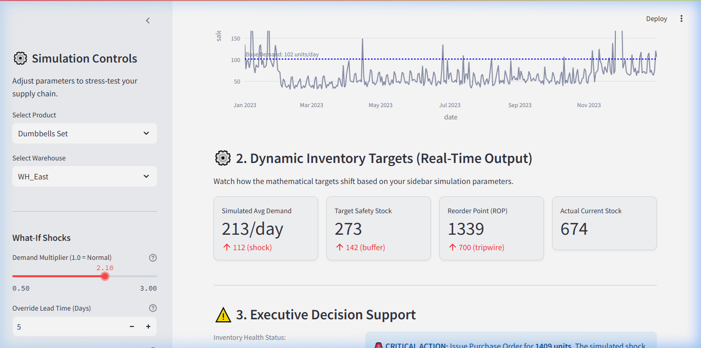
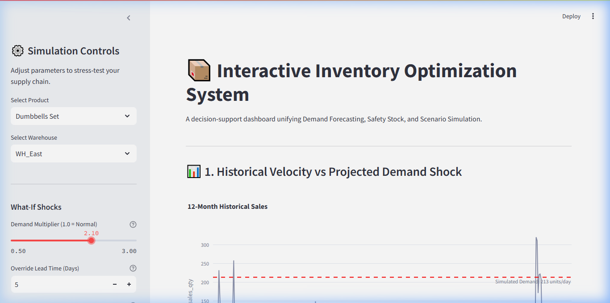
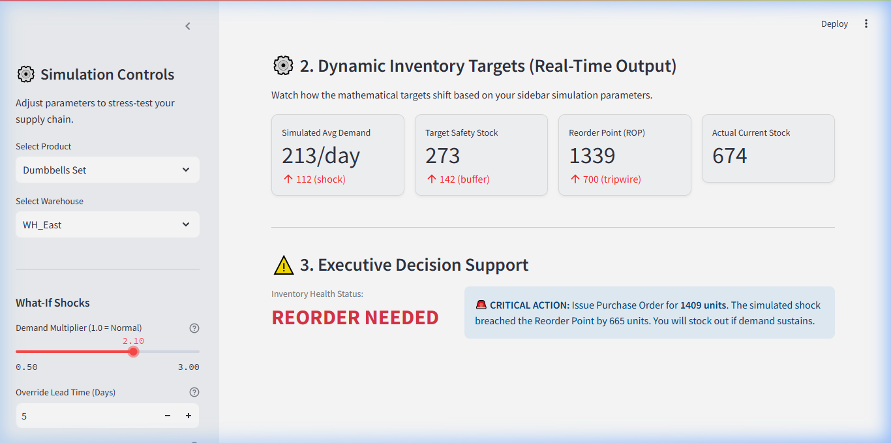

# 📦 Interactive Inventory Optimization & Simulation System



## 📊 Project Overview
In the fast-paced E-commerce industry, inventory planners are constantly caught between two massive financial risks: **Stockouts** (which destroy customer trust and revenue during spikes like Black Friday) and **Overstocking** (which traps crucial working capital in dead warehousing costs). 

This project is an end-to-end, decision-support system built to bridge the gap between Data Science and Supply Chain Operations. Rather than relying on static historical averages, this system leverages Machine Learning to explicitly forecast demand and translates those predictions into dynamic operations mathematics (Safety Stock, Reorder Point, EOQ). We wrap this logic in a proactive, interactive "What-If" Simulation Engine to battle-test the supply chain against market shocks.

## 🎯 Objectives
*   **Prevent Stockouts:** Ensure inventory levels intelligently adapt to predicted demand spikes.
*   **Free Up Capital:** Identify and "bleed down" dead-stock tying up warehouse space.
*   **Operationalize Data:** Transform complex Machine Learning predictions into an intuitive, interactive dashboard for non-technical Supply Chain Managers.

## ✨ Key Features
1.  **Machine Learning Demand Forecasting:** Utilizes Meta's `Prophet` library to learn historical trends, weekly seasonality (e.g., Saturday surges), and promotional shock multipliers.
2.  **Dynamic Inventory Optimization:** Instantly calculates required Safety Stock (buffered by Z-Score service levels), Reorder Points (ROP), and Economic Order Quantity (EOQ).
3.  **Interactive Simulation Engine:** A "What-If" playground where Planners can simulate supplier port strikes (e.g., +5 Days Lead Time) or viral marketing campaigns (e.g., +30% Demand) to see the exact financial and unit impact. 
4.  **Executive Dashboard:** A clean, minimal `Streamlit` application that outputs automated, color-coded business directives (e.g., *CRITICAL: Issue PO for 240 units*).

## 🛠️ Tech Stack & Architecture
*   **Language:** Python
*   **Libraries:** `pandas`, `numpy`, `scipy`, `prophet`, `plotly`
*   **Frontend UI:** `streamlit`
*   **Data Integration:** Google Sheets API (via `gspread`) for live inventory syncs.

### Architecture Flow
`Raw CSV/Live Sheets` ➔ `Exploratory Data Analysis` ➔ `Prophet Demand Forecast` ➔ `Static Optimization Math` ➔ `Streamlit Simulation Engine` ➔ `Final Business Directive`

## 💡 Key Business Insights
1. **The 'Fitness' Anchor:** Fitness equipment commands the network's highest volume and experiences an isolated seasonal surge in January. This demands a fully decoupled provisioning strategy from slower-moving electronics.
2. **Structural Warehouse Imbalance:** Warehouse East processes ~60% of all network volume across channels. A global inventory policy will continually starve East while overstocking West. Demand must be calculated per node.
3. **The Danger of Lead Times:** The simulation engine mathematically proves that *Lead time delays (e.g., +5 days) severely inflate Safety Stock requirements*. Planners must order long before visual checks indicate low stock.
4. **Promotion Multipliers:** Standard historical promotions doubled (2.0x) base demand, while Black Friday tripled it (3.0x). The ML model securely captured this effect, demonstrating that static Moving Averages are dangerously insufficient for volatile retail.

## 📸 Demo & Visuals

*   **The Simulation Dashboard (Overview):**
    
*   **The Reorder Alert & Metrics Shift:**
    
*   **Historical vs Projected Demand Chart:** 
    
*   **Executive Decision Support Module:** 
    

## 🚀 How to Run the Project Locally
If you want to spin up the Streamlit simulation on your own machine:

1. Clone the repository: 
   ```bash
   git clone https://github.com/YourUsername/inventory-optimization-system.git
   cd inventory-optimization-system
   ```
2. Set up an isolated virtual environment and activate it:
   ```bash
   python -m venv env
   .\env\Scripts\activate   # Windows
   # source env/bin/activate  # Mac/Linux
   ```
3. Install the dependencies:
   ```bash
   pip install -r app/requirements.txt
   ```
4. Run the Streamlit Dashboard:
   ```bash
   streamlit run app/app.py
   ```

## 🏗️ Future Improvements
*   **API Expansion:** Shift the data backbone entirely to Google BigQuery or PostgreSQL.
*   **Multi-Echelon Optimization:** Add capabilities to transfer Overstock units from `Warehouse_West` to `Warehouse_East` dynamically before issuing external Purchase Orders.

---
*Created and developed by **Singgih Hamdani Ma'ruf** — Connect with me on [LinkedIn](https://www.linkedin.com/in/singgihhamdani/)!*
